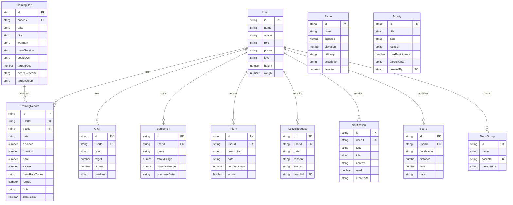

## 1. 架构设计

```mermaid
graph TB
    "前端 React App" --> "Zustand 状态管理"
    "Zustand 状态管理" --> "Mock 数据层"
    "前端 React App" --> "React Router 路由"
    "前端 React App" --> "TailwindCSS 样式"
    "前端 React App" --> "Recharts 图表"
```

本项目为纯前端应用，使用 Mock 数据模拟后端接口，后续可扩展接入真实后端。

## 2. 技术说明

- **前端框架**：React 18 + TypeScript + Vite
- **样式方案**：TailwindCSS 3（自定义主题色）
- **状态管理**：Zustand
- **路由**：React Router DOM v6
- **图表库**：Recharts（趋势图、心率区间、排名）
- **图标**：lucide-react
- **数据层**：Mock 数据（src/mock/），模拟教练和队员角色的完整数据
- **项目模板**：react-ts

## 3. 路由定义

| 路由 | 用途 |
|------|------|
| / | 首页 - 今日概览与快捷入口 |
| /training | 训练 - 训练日历与课表 |
| /training/record | 训练记录 - 配速与心率录入 |
| /training/checkin | 打卡签到 |
| /training/fatigue | 疲劳自评 |
| /team | 队伍 - 分组名单与排名 |
| /team/leave | 请假报备 |
| /team/activity | 活动报名 |
| /routes | 路线 - 路线列表与收藏 |
| /routes/:id | 路线详情 |
| /data | 数据 - 趋势图表与目标 |
| /data/goals | 个人目标 |
| /data/scores | 成绩录入 |
| /data/assessment | 赛前测评 |
| /data/equipment | 装备寿命 |
| /data/injury | 伤病提醒 |
| /notifications | 通知 - 消息列表 |
| /profile | 个人 - 资料与设置 |

## 4. 数据模型

### 4.1 数据模型定义



## 5. 项目目录结构

```
src/
├── components/          # 通用组件
│   ├── Layout.tsx       # 底部Tab布局
│   ├── TabBar.tsx       # 底部导航栏
│   ├── ProgressRing.tsx # 环形进度
│   └── Card.tsx         # 通用卡片
├── pages/               # 页面组件
│   ├── Home/            # 首页
│   ├── Training/        # 训练模块
│   ├── Team/            # 队伍模块
│   ├── Routes/          # 路线模块
│   ├── Data/            # 数据模块
│   ├── Notifications/   # 通知模块
│   └── Profile/         # 个人模块
├── stores/              # Zustand状态
│   ├── useUserStore.ts
│   ├── useTrainingStore.ts
│   ├── useTeamStore.ts
│   └── useNotificationStore.ts
├── mock/                # Mock数据
│   ├── users.ts
│   ├── training.ts
│   ├── routes.ts
│   └── notifications.ts
├── utils/               # 工具函数
├── App.tsx              # 路由入口
└── main.tsx             # 应用入口
```
